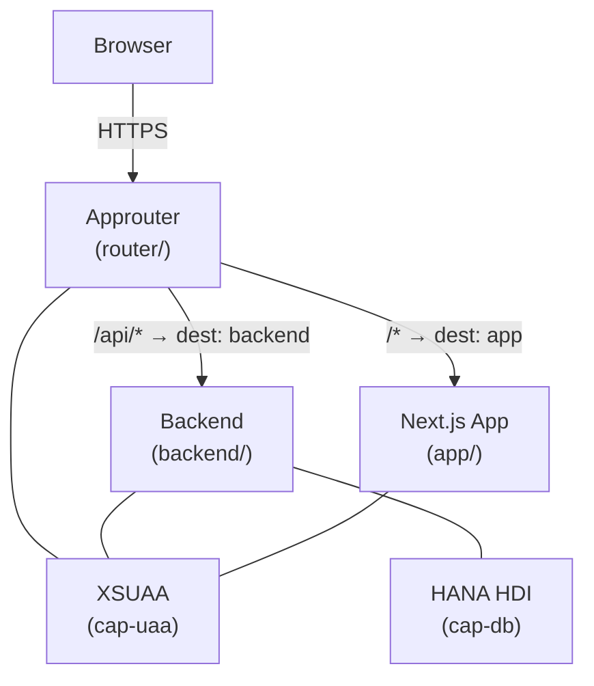

# nextjs-sap-btp

Polyglot app for SAP Business Technology Platform (BTP) — Next.js standalone frontend, Node.js backend, and SAP Approuter as the entry point, secured via XSUAA.

## Architecture



All traffic enters through the Approuter. XSUAA tokens are validated there and forwarded as `Authorization: Bearer` headers to both downstream modules.

## Components

### `app/` — Next.js Frontend

| | |
|---|---|
| Framework | Next.js 16 (App Router) |
| Runtime | Node.js 22 (container runtime) |
| Build output | `output: 'standalone'` → `.next/standalone/` |
| CF port | Read from `$PORT` env variable |
| Auth | JWT decoded from forwarded Bearer token — see [app/src/lib/auth.ts](app/src/lib/auth.ts) |

The standalone build bundles all Node.js dependencies so the CF droplet needs no `npm install` at runtime.

For container builds, the app is built and run with Node.js to avoid Bun runtime incompatibilities in Next.js server output.

Start locally:

```bash
cd app
bun install
bun run dev
```

### `backend/` — Backend Service (mock)

ElysiaJS mock server that stubs the API routes the approuter forwards under `/api/*`. Uses `@elysiajs/node` adapter so it runs on plain Node.js in CF (no Bun required at runtime). Intended to be replaced with a full SAP CAP service.

| Endpoint | Response |
|---|---|
| `GET /` | `{ message: "Backend mock running" }` |
| `GET /health` | `{ status: "ok", timestamp }` |
| `GET /entities` | Array of 3 mock entities |

Start locally:

```bash
cd backend
bun install
bun run dev        # port 3001, runs with Bun directly
```

Build for production (Node.js bundle used on CF):
```bash
bun run build      # outputs dist/index.js (bundled, no external deps)
```

### `router/` — SAP Approuter

Entry point for all incoming traffic. Handles XSUAA authentication and proxies requests to the two downstream destinations.

Routing rules ([router/xs-app.json](router/xs-app.json)):

| Source | Destination | Auth |
|---|---|---|
| `/api/*` | `backend` | XSUAA + CSRF |
| `/*` | `app` | XSUAA |

[router/xs-app.local.json](router/xs-app.local.json) is used in the local compose stack — disables XSUAA so the stack runs without a BTP account.

### `manifest.yml` — CF Docker Deployment

Cloud Foundry push manifest for deploying pre-built container images. Replace `<OWNER>` and `<CF_DOMAIN>` before use.

| App | Image | CF memory |
|---|---|---|
| `nextjs-sap-btp-backend` | `ghcr.io/<OWNER>/nextjs-sap-btp-backend` | 256 MB |
| `nextjs-sap-btp-app` | `ghcr.io/<OWNER>/nextjs-sap-btp-app` | 512 MB |
| `nextjs-sap-btp-approuter` | `ghcr.io/<OWNER>/nextjs-sap-btp-approuter` | 128 MB |

### `compose.yml` — Local Development

Runs all three services locally as containers without XSUAA. The Approuter uses [router/xs-app.local.json](router/xs-app.local.json) (mounted read-only) and resolves destinations via compose service names.

| Service | Port |
|---|---|
| `backend` | 3001 |
| `app` | 3000 |
| `approuter` | 5001 |

### `mta.yaml` — Alternative: MTA Deployment

Describes all three CF modules and two managed service instances for the MTA build tool (`mbt`). Use this if you prefer MTA over `cf push` with Docker images.

| Module | CF memory | Path |
|---|---|---|
| `backend` | 256 MB | `backend/` |
| `app` | 512 MB | `app/` (builds to `.next/standalone/`) |
| `approuter` | 128 MB | `router/` |

| Resource | Type | Plan |
|---|---|---|
| `cap-uaa` | XSUAA | `application` |
| `cap-db` | HANA | `hdi-shared` |

### `xs-security.json`

Minimal XSUAA application security descriptor. Defines the `xsappname` used by the `cap-uaa` service instance. Extend with scopes and role-templates as the application grows.

## Prerequisites

- [Docker](https://docs.docker.com/get-docker/) or [Podman](https://podman.io/) (for building and running containers)
- [CF CLI](https://docs.cloudfoundry.org/cf-cli/) v8+
- [Bun](https://bun.sh) ≥ 1.3.5 (used for backend build stage and optional local app dev)
- SAP BTP subaccount with Cloud Foundry environment enabled
- HANA Cloud instance (optional for current Docker flow; required only when enabling `cap-db` again)
- GitHub account for pushing images to `ghcr.io`

**MTA deployment only:**
- [MultiApps CF CLI Plugin](https://github.com/cloudfoundry/multiapps-cli-plugin): `cf install-plugin multiapps`
- [MTA Build Tool](https://github.com/SAP/cloud-mta-build-tool) (`mbt`) v1.2+

## BTP Activation for Docker Deployment

By default, SAP BTP Cloud Foundry does not allow Docker images. A **Platform Admin** must enable it once per CF instance:

```bash
cf enable-feature-flag diego_docker
```

Verify it is active:
```bash
cf feature-flag diego_docker
# → state: enabled
```

If you do not have Platform Admin rights, contact your BTP administrator.

## Local Development

### With containers (full stack)

```bash
# Build all images and start the full stack
docker compose up --build
# or with Podman:
podman compose up --build
```

The Approuter is available at `http://localhost:5001`. Auth is disabled — no BTP account needed.

### Without containers (per service)

```bash
# Backend (port 3001)
cd backend && bun run dev

# Frontend (port 3000)
cd app && bun run dev
```

## Docker Deployment on CF

### 1. Create CF services

```bash
cf login -a <api-endpoint> -o <org> -s <space>

cf create-service xsuaa application cap-uaa -c xs-security.json
```

### 2. Build and push images

```bash
# Replace <OWNER> with your GitHub username
export OWNER=<OWNER>

docker build -f backend/Containerfile -t ghcr.io/$OWNER/nextjs-sap-btp-backend:latest backend/
docker build -f app/Containerfile     -t ghcr.io/$OWNER/nextjs-sap-btp-app:latest     app/
docker build -f router/Containerfile  -t ghcr.io/$OWNER/nextjs-sap-btp-approuter:latest router/

docker push ghcr.io/$OWNER/nextjs-sap-btp-backend:latest
docker push ghcr.io/$OWNER/nextjs-sap-btp-app:latest
docker push ghcr.io/$OWNER/nextjs-sap-btp-approuter:latest
```

> For private images, log in first: `docker login ghcr.io -u <OWNER> --password-stdin`

### 3. Configure `manifest.yml`

Edit [manifest.yml](manifest.yml) and replace the two placeholders:

Use `cf domains` to list your available CF domains.

| Placeholder | Value |
|---|---|
| `<OWNER>` | Your GitHub username |
| `<CF_DOMAIN>` | Your CF apps domain, e.g. `cfapps.eu10.hana.ondemand.com` |

### 4. Push to CF

```bash
# For private GHCR images, set password token as env var:
export CF_DOCKER_PASSWORD=<GHCR_TOKEN_WITH_READ_PACKAGES>
cf push

# For public images:
cf push
```

All three apps are deployed and bound to `cap-uaa` as defined in `manifest.yml`.

### 5. Troubleshooting: GHCR unauthorized during staging

If staging fails with `unable to retrieve auth token: invalid username/password: unauthorized`, Cloud Foundry cannot pull your image from GHCR.

Use a GitHub token with package read permission:

```bash
export CF_DOCKER_PASSWORD=<GITHUB_TOKEN_WITH_READ_PACKAGES>
cf push
```

Notes:
- For private GHCR images, token scope must include `read:packages`.
- If the token is used for image push as well, add `write:packages`.
- If your GitHub org enforces SSO, authorize the token for that org.
- If images are public, plain `cf push` works without docker credentials.
- `--docker-username` can only be used together with `--docker-image` for single-app push, not with this multi-app manifest flow.

## Alternative Deployment: MTA

If you prefer MTA over individual `cf push`:

```bash
cf install-plugin multiapps
mbt build --mtar my-btp-project.mtar
cf deploy mta_archives/my-btp-project.mtar
```

## Known Issues

### 1. Backend is a mock — no real CAP model

`backend/` contains an ElysiaJS stub. Replace with a proper SAP CAP project:

```bash
cd backend
cds init --add hana,xsuaa
# add .cds data models and service definitions
```

### 2. `xs-security.json` has no scopes

The file exists but is minimal. Add scopes and role-templates matching your CAP service annotations before deploying to production.

### 3. JWT decoded without signature verification in `auth.ts`

`jwt-decode` skips signature validation. This is safe **only** because the Approuter validates the token before forwarding. Never expose `app/` directly without the Approuter in front.

### 4. `console.log` in `auth.ts` leaks decoded JWT

Remove before deploying to production:

```diff
- console.log('decoded:', decoded)
```
